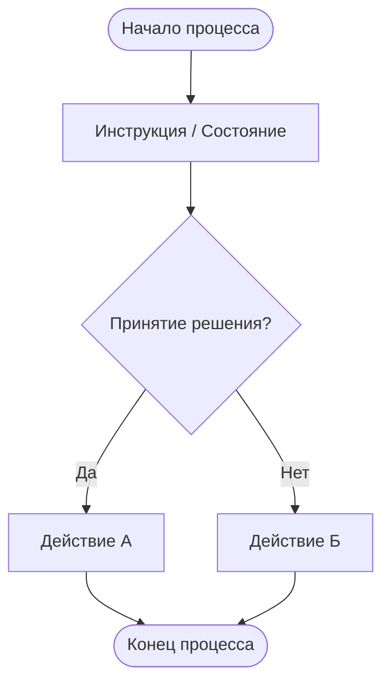
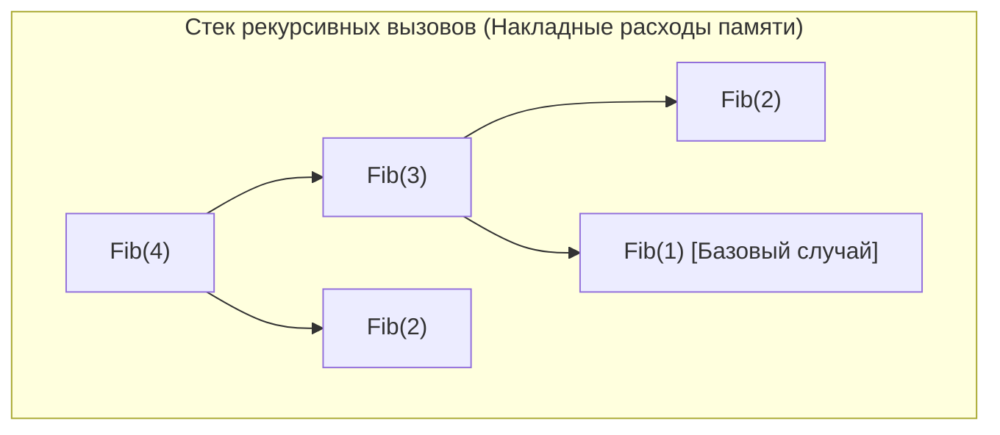
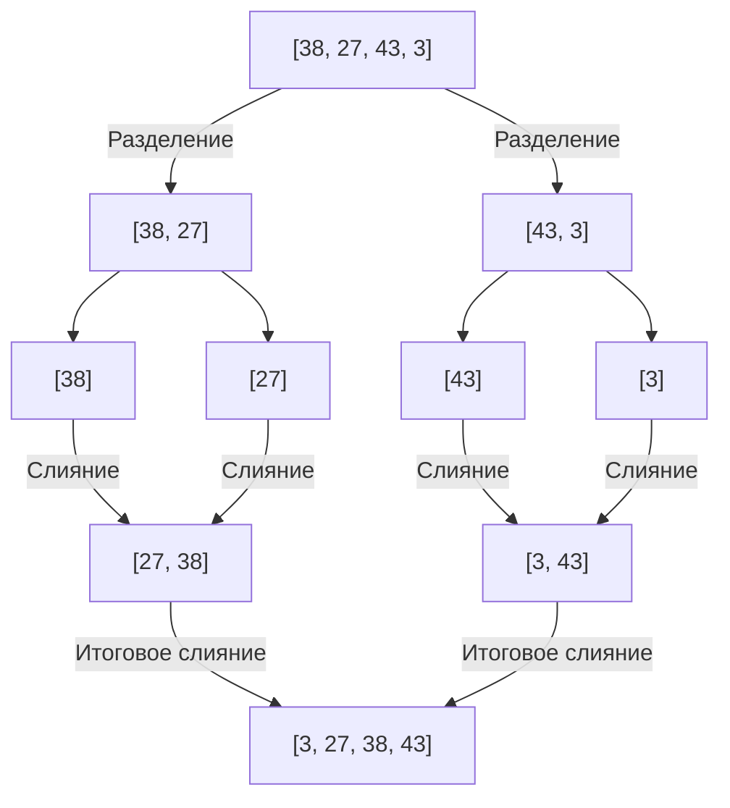
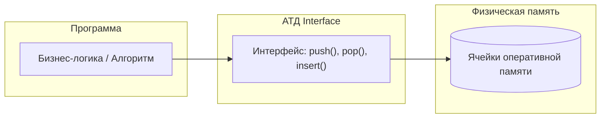
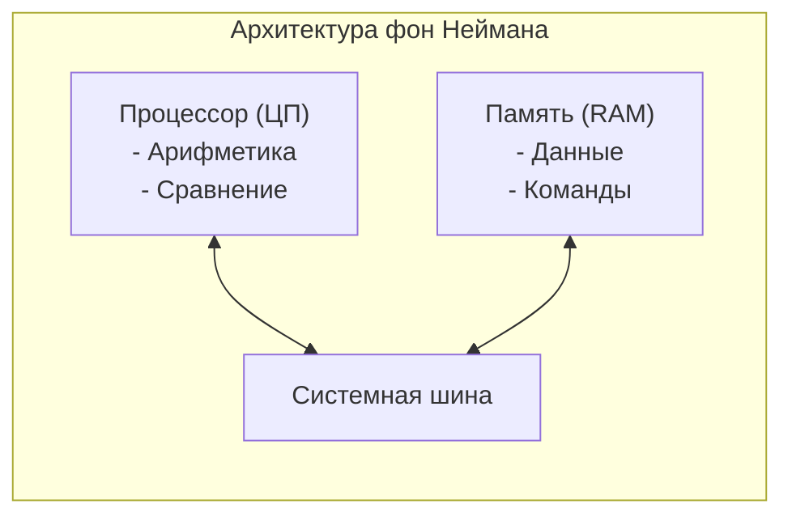
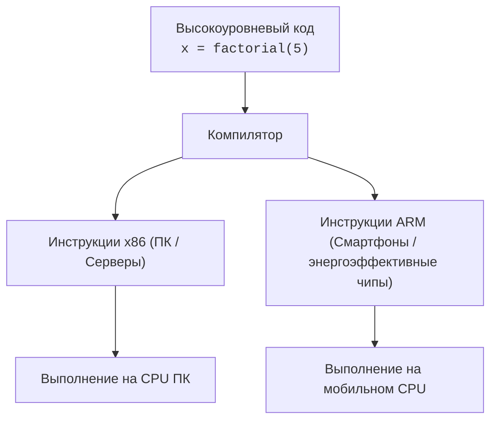

# Почитаем ? Теоретический минимум по Computer Science

> [!abstract] Краткая выжимка (TL;DR)
> **Суть в 1–2 предложениях:** Экспресс-разбор книги Владстона Феррейры Фило «Теоретический минимум по Computer Science», охватывающий базовую математическую логику, оценку временной и пространственной сложности алгоритмов, базовые алгоритмические стратегии, абстрактные типы данных и фундаментальные принципы архитектуры компьютеров.
> 
> **Ключевые инсайты:**
> - Любая алгоритмическая задача перед реализацией должна моделироваться через блок-схемы, псевдокод или математические модели [00:01:37].
> - При оценке эффективности алгоритмов первостепенную роль играет худший случай (Worst Case), гарантирующий верхнюю границу требуемых ресурсов [00:10:38].
> - Выбор между итерацией и рекурсией всегда является компромиссом между простотой кода и накладными расходами на стек вызовов и память [00:18:28].
> - Абстрактные типы данных (АТД) изолируют интерфейс работы со структурами от деталей их физического размещения в памяти [00:24:53].
> - Процессор оперирует лишь базовыми операциями сравнения и сложения, а компилятор выступает транслятором высокоуровневых выражений в машинный код конкретной архитектуры [00:36:15].

> [!todo] Action Items (Что сделать / применить)
> - [ ] При анализе эффективности собственных функций рассчитывать как временную ($O(n)$), так и пространственную сложность (потребление памяти) [00:12:37].
> - [ ] Избегать глубокой рекурсии в высоконагруженных узлах, заменяя её итеративными алгоритмами [00:19:10].
> - [ ] Проектировать интерфейсы модулей данных в виде АТД, скрывая детали прямого доступа к структурам памяти [00:25:54].

---

## Подробный конспект с визуализациями

### 1. [[Идеи и дискретная математика]] `[00:01:00]`
- **Ключевая мысль:** Информатика неразрывно связана с математикой; алгоритмическая задача сначала формализуется в виде логической схемы [00:01:00].
- **Правила построения блок-схем:** Прямоугольники для действий, ромбы для ветвлений, строгое разделение инструкций и условий [00:01:56].



> [!tip] Математическая логика и операторы
> - **Импликация ($A \to B$):** $A$ влечёт $B$ [00:04:07]. *Ошибка обращения:* из $A \to B$ **не** следует $B \to A$ [00:05:37].
> - **Контрапозиция:** $A \to B \iff \neg B \to \neg A$ (равносильное суждение) [00:04:51].
> - **Эквивалентность ($A \leftrightarrow B$):** Истинны только одновременно ($A$ тогда и только тогда, когда $B$) [00:06:01].

| Оператор | Название | Условие истинности ($True$) | Аналог из видео |
| :--- | :--- | :--- | :--- |
| **AND** | Логическое И | Все операнды истины | Пил и водку, и вино [00:06:41] |
| **OR** | Логическое ИЛИ | Хотя бы один операнд истинен | Пил вино или водку (или оба) [00:06:50] |
| **XOR** | Исключающее ИЛИ | Ровно один из двух истинен | Пил строго что-то одно, не смешивая [00:06:50] |

---

### 2. [[Вычислительная сложность]] `[00:07:30]`
- **Временная сложность:** Зависимость числа операций от объёма входящих данных $N$ [00:09:15].
- **Сценарии работы алгоритма:**
  - *Best Case (Лучший):* Данные уже упорядочены [00:09:59].
  - *Average Case (Средний):* Случайный порядок входных данных [00:10:28].
  - *Worst Case (Худший):* Худший сценарий (например, обратный порядок); служит главной инженерной гарантией [00:10:18].

```
Рост затрат времени при масштабировании N:
Количество операций
  ^
  |                                        . O(2^n) Экспонента
  |                                 . '    . O(n^2) Сортировка выбором
  |                          . '           . O(n log n) Merge Sort
  |                   . '                  . O(n) Линейный поиск
  |            . '                         
  |  . ' ' ' ' ' ' ' ' ' ' ' ' ' ' ' ' ' ' . O(1) Константный доступ
  +---------------------------------------------> Размер входных данных (N)
```

> [!example] Временная vs Пространственная сложность на примере Selection Sort
> - **Временная сложность:** $O(n^2)$ — удвоение списка увеличивает время сортировки почти в $4$ раза ($3.86 \to 3.94 \to 3.98 \to 4$) [00:11:42].
> - **Пространственная сложность:** $O(1)$ — требует фиксированного объёма памяти под несколько вспомогательных переменных, независимо от длины списка [00:13:08].

---

### 3. [[Алгоритмические стратегии]] `[00:14:11]`

#### А. Рекурсия против Итерации
- **Итерация ($O(n)$):** Циклический проход, высокая скорость, минимальные накладные расходы по памяти [00:14:29].
- **Рекурсия:** Делегирование задачи уменьшенным копиям самой себя с опорой на **базовый случай** [00:17:08].



> [!warning] Накладные расходы рекурсии
> Рекурсивный код компактнее, но потребляет память под стек вызовов и тратит процессорные такты на переключение контекста [00:18:28]. Любую рекурсию можно переписать в итеративном виде [00:19:10].

#### Б. Сортировка слиянием (Divide and Conquer) `[00:20:15]`



---

### 4. [[Абстрактные типы данных (АТД)]] `[00:22:15]`
Абстракция изолирует алгоритмическую логику от прямого взаимодействия с ячейками RAM [00:24:53].



#### Визуализация базовых структур данных

```
  СТЕК (LIFO)                        ОЧЕРЕДЬ (FIFO)
  Last In, First Out                 First In, First Out

      |      |                           |   |   |   |   |
  push|  ||  |pop                 In ->  | 4 | 3 | 2 | 1 | -> Out
      v  ||  ^                           |   |   |   |   |
     [  Элемент 3  ] (Вершина)           (Конец)       (Начало)
     [  Элемент 2  ]
     [  Элемент 1  ]
     +-------------+
```

- **Стек (Stack):** Добавление и удаление только с вершины (`push` / `pop`) [00:28:56]. *(Пример: Ctrl+Z / отмена действия).*
- **Очередь (Queue):** Добавление в конец, извлечение из начала [00:29:57].
- **Очередь с приоритетом:** Извлечение элемента с наивысшим приоритетом (планировщик процессов ОС) [00:30:25].
- **Список (List):** Произвольный доступ и модификация по индексу [00:31:33].
- **Множество (Set):** Неупорядоченная коллекция уникальных элементов [00:32:01].
- **Словарь (Map / Dict):** Хранилище пар `Key -> Value` с мгновенным доступом по ключу [00:32:32].

---

### 5. [[Архитектура компьютера и компиляция]] `[00:33:00]`



#### Конвейер компиляции `[00:36:38]`
Процессор понимает только примитивные операции (сложение чисел, перемещение байтов). Языки программирования позволяют писать компактный код, который компилятор раскладывает в длинную последовательность машинных инструкций конкретного процессора:



---

## Упомянутые ресурсы и связи
- **Персоналии / Источники:**
  - [[Эдсгер Дейкстра]] (цитата о связи информатики с математикой) [00:01:00]
  - [[Эмануэль Ласкер]] (эпиграф о стратегии) [00:14:11]
  - [[Линус Торвальдс]] (цитата о важности структур данных) [00:22:15]
  - [[Джон фон Нейман]] (архитектура ЭВМ 1945 года) [00:33:32]
  - Книга: Владстон Феррейра Фило — *«Теоретический минимум по Computer Science»* [00:00:14]
- **Связанные концепты:**
  - [[Алгоритмическая сложность]]: $O(1)$, $O(n)$, $O(n \log n)$, $O(n^2)$, $O(2^n)$ [00:11:07, 00:13:08, 00:15:15, 00:16:40]
  - [[Структуры данных]]: Stack, Queue, Priority Queue, Set, Hash Map [00:28:56, 00:29:57, 00:30:25, 00:32:01, 00:32:32]
  - [[Архитектура ЭВМ]]: CPU, RAM, x86, ARM, Compiler [00:33:43, 00:35:23, 00:36:38]