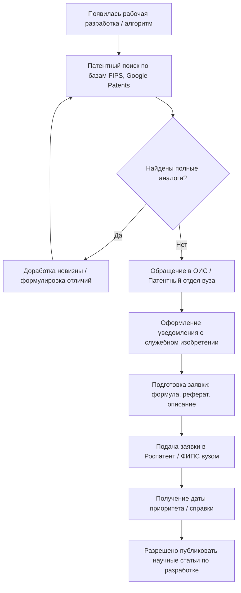

---
tags:
  - academic
  - guide
  - university
  - patents
  - research
  - publishing
aliases:
  - Патентование и научные публикации в вузе
created: 2026-09-16
status: evergreen
---

# 🎓 Гайд: Патентование, написание статей и публикация в вузе

> [!abstract] Ключевой принцип
> **Сначала защита интеллектуальной собственности, затем публикация.**  
> Если предварительно раскрыть решение (в докладе, тезисах, препринте или статье), оно автоматически теряет критерий мировой новизны, и в получении патента на изобретение/полезную модель будет отказано.

---

## 1. Защита интеллектуальной собственности и патенты в вузе

В каждом университете действует профильное подразделение: **Отдел интеллектуальной собственности (ОИС)**, **Патентный отдел** или сектор при Управлении научных исследований (УНИ/НИЧ).

### 1.1. Классификация объектов защиты

| Тип объекта | Что защищает | Срок оформления | Особенности |
| :--- | :--- | :--- | :--- |
| **Свидетельство на программу для ЭВМ / БД** | Исходный код, архитектуру базы данных | 2–6 недель | Экспертиза только формальная (проверка депонируемого листинга и реферата). Идеально для IT-проектов и студентов. |
| **Патент на полезную модель** | Конструктивное устройство, техническое решение «в железе» | 6–10 месяцев | Проверяются новизна и промышленная применимость (без изобретательского уровня). |
| **Патент на изобретение** | Способ, алгоритм, устройство, вещество | 12–18 месяцев | Полная экспертиза по существу (мировая новизна, неочевидность, технический результат). |

### 1.2. Пошаговый пайплайн взаимодействия с вузом



> [!tip] Кто правообладатель?
> В подавляющем большинстве случаев при подаче через вуз:
> * **Правообладатель:** Университет (берет на себя пошлины и юридическое оформление).
> * **Авторы:** Вы и научный руководитель (указываетесь бессрочно, сохраняя неотчуждаемое авторское право и право на вознаграждение при коммерциализации).

---

## 2. Написание научной статьи (Методология IMRaD)

### 2.1. Анатомия академического текста

```
+-------------------------------------------------------------+
|                      TITLE & ABSTRACT                       |  Квинтэссенция работы
+-------------------------------------------------------------+
|                        INTRODUCTION                         |  Why: контекст, актуальность,
|                                                             |  проблема, Research Gap
+-----------------------------+-------------------------------+
|                       METHODOLOGY                           |  How: архитектура, стек,
|                                                             |  математика, схема теста
+-----------------------------+-------------------------------+
|                         RESULTS                             |  What: таблицы, метрики,
|                                                             |  графики, валидация
+-------------------------------------------------------------+
|                        DISCUSSION                           |  So what: сравнение с базой,
|                                                             |  ограничения, интерпретация
+-------------------------------------------------------------+
|                        CONCLUSION                           |  Итог и дальнейшие планы
+-------------------------------------------------------------+
|                        REFERENCES                           |  Актуальная литература (3-5 лет)
+-------------------------------------------------------------+
```

### 2.2. Чек-лист по разделам

- [ ] **Title:** Четкий, емкий, содержит ключевые слова без лишней «воды».
- [ ] **Abstract:** 150–250 слов:
  - 1–2 предложения: фон и решаемая проблема.
  - 1–2 предложения: предложенный метод/инструмент.
  - 1–2 предложения: конкретные численные результаты (например, *«точность выросла на 12%»*).
  - 1 предложение: практическая ценность.
- [ ] **Introduction:** Наличие явной формулировки «Research Gap» (*«Несмотря на развитие X, задача Y остается нерешенной из-за Z»*).
- [ ] **Methods:** Достаточно подробностей для воспроизводимости независимым исследователем.
- [ ] **Results:** Использование векторных графиков (SVG/PDF), четких подписей осей, доверительных интервалов и baseline-сравнений.
- [ ] **References:** Использование референс-менеджеров (Zotero / Mendeley), приоритет статьям из Q1/Q2 и топ-конференций.

---

## 3. Публикация и работа с издательствами

### 3.1. Выбор площадки

| Уровень | Примеры | Цели | Сроки |
| :--- | :--- | :--- | :--- |
| **РИНЦ / Вузовские сборники** | Студенческие конференции, дни науки | Первые публикации, баллы на ПГАС, апробация | 1–2 мес. |
| **ВАК (К1, К2, К3)** | Отраслевые журналы из Перечня ВАК | Требования к защите ВКР/диссертации, гранты | 3–8 мес. |
| **Scopus / WoS / IEEE / Springer** | IEEE Access, конференции CORE A/B/C | Международная видимость, сильное резюме, гранты РНФ | 4–12 мес. |

### 3.2. Внутривузовский процесс согласования

> [!warning] Экспертное заключение (Акт экспортного контроля)
> Перед отправкой статьи в любой открытый журнал или сборник конференции **обязательно** оформляется:
> 1. **Акт экспертизы об отсутствии сведений, составляющих государственную тайну.**
> 2. **Заключение о возможности открытого опубликования.**
> Документы подписываются комиссией факультета/института. Без них публикация является нарушением внутренних регламентов университета.

### 3.3. Взаимодействие с рецензентами (Peer Review)

При получении рецензии с вердиктом *Major Revision* или *Minor Revision*:
* Подготовьте отдельный документ **Response to Reviewers**.
* Цитируйте каждое замечание рецензента дословно.
* Пишите вежливый, аргументированный ответ под каждым пунктом.
* Выделяйте изменения в итоговом тексте статьи цветом или трекингом.

---

## 4. Инструментарий исследователя

* **Верстка:** [[LaTeX]] (Overleaf), Markdown (Obsidian / Pandoc).
* **Менеджеры источников:** Zotero (с плагинами *Better BibTeX* и *Zotero Integration* для Obsidian).
* **Поиск литературы:** Google Scholar, Semantic Scholar, ResearchGate, eLibrary.
* **Патентные базы:** [ФИПС / Роспатент](https://www.fips.ru), [Google Patents](https://patents.google.com), [Espacenet](https://worldwide.espacenet.com).
